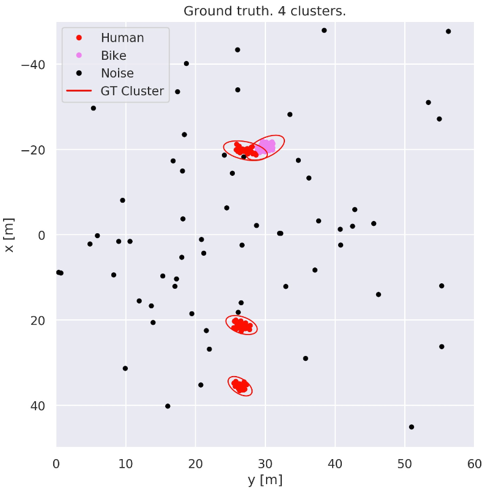

### Clustering and Classifying Radar Data using Deep Learning

**In the context of surveillance, intelligent radars can guess what a blob of radar detections encompasses. It may be unnecessary to call the guards if a rabbit enters the monitored area, but if a person or a vehicle does so, measures may be required.**

To perform such a guess, all detections sampled by the radar are first clustered (grouped together) based on the detections' spatial coordinates. Different clusters are assumed to comprise distinct objects. By observing the size of an object, radial velocity, and how it moves in time, the class of the object is guessed, for example 'human', 'car' or 'animal'.

With this thesis we aim to improve upon the clustering. In the original pipeline, clustering is performed considering only the detections' spatial coordinates, $x$ and $y$. By first guessing the class of every detection in the monitored scene, however, it should be possible to cluster the detections more accurately. If a blob of detections expresses characteristics associated with a rabbit, for example, we can expect a small cluster, and if they seem to belong to a bus, we can expect a larger cluster. This will help the clustering.

To guess the class of each detection, we use deep neural networks that learn from the data we feed them.
Our networks are just like children that learn how to color objects. If we say that cucumbers are green, they will color cucumbers green. If we say that cucumbers can be both green and red, they will believe us and color new cucumbers with a mixture of both green and red. Thus, it is important to give the networks correct training data, or they will be confused.

The main network we investigate is PointNet++, from 2017. It learns features hierarchically at different scales, much like CNNs, which dominate the field of computer vision for camera images. CNNs can be seen as a mathematical replication of the functionality of a biological eye-brain combination, with neurons acting at different scales to extract features of objects at different abstraction levels, as discovered by Hubel and Wiesel.

Combining the clustering output with our guesses for each detection in the scene, we also get a natural way of classifying objects: taking the most frequent class prediction of all the detections that comprise an object. If these classifications are better than those of the original pipeline, it means we can improve upon it.

The results are promising, and on par with the original pipeline, both for clustering and classification of objects. We show that the results improve with the amount of training data. We have also noted that we sometimes give the wrong object-color combination to our networks. Thus, if more data was collected, and the quality of the data was improved, our networks could improve upon the original pipeline.

Our hope is that classification could also be performed faster than the original pipeline. So if a human enters a scene, it can be labeled as a human more quickly, decreasing the probability of it leaving the scene before being classified. This would be very beneficial to the end user, in the context of surveillance.

### Example of a scene with 4 objects

