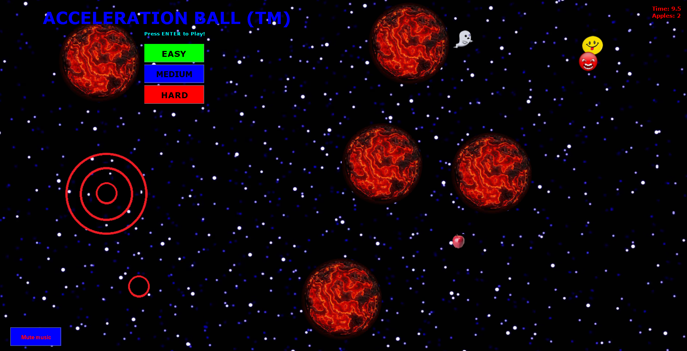

### TOTO
- fixa länkar för alla items i Contents
- 


### Contents


### About me

My name is Jonatan. That is all you need to know.

...

...

...

...

...

...

...


### Markdown

(Se hela instruktioner på: /blog).

Markdown is a lightweight and easy-to-use syntax for styling your writing. It includes conventions for

```markdown
Syntax highlighted code block block block block

# Header 1
## Header 2
### Header 3 block block block block block

- Bulleted
- List

1. Numbered
2. List

**Bold** and _Italic_ and `Code` text

[Link](url) and 
```

### Markdown in action

# Header 1

## Header 2

- Bulleted
- List

1. Numbered
2. List

**Bold** and _Italic_ and `Code` text

[Link](https://jontamazon.github.io/blog) and 


