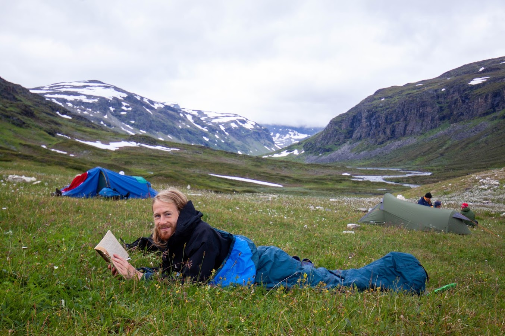

### Content

[Master's thesis popular summary](https://jontamazon.github.io/MastersThesis)

[AccelerationBall](https://jontamazon.github.io/AccelerationBall)

### About me

My name is Jonatan, I was born in 1995 and grew up in Stockholm. Between 2015-2020 I studied Engineering Physics at Lund University. \
In September 2020 I started studying German and in May 2021 I obtained a B2 German certificate from the Goethe Institute. \
Next, I would like to start working.

<!--
He was traveling from Chicago
to Joliet, he said, on the expressway,
Old State Highway 59, when a
semi rollover caused a load of potatoes
to scatter across the road.

People stopped, pulled their
pickups and jeeps, their Chevy vans
and VW bugs off to the shoulder,
got out and dashed across three lanes
of traffic after Idaho russets and
Yukon Golds, reds and whites and yams.

I’d have understood if it were
a Brinks truck with flyaway tens
and twenties. But potatoes?
Perhaps it was the fact of
sudden bounty dropping down
in front of you, and like unexpected
grace, you must be grateful,
whatever it is that is given.
-->

